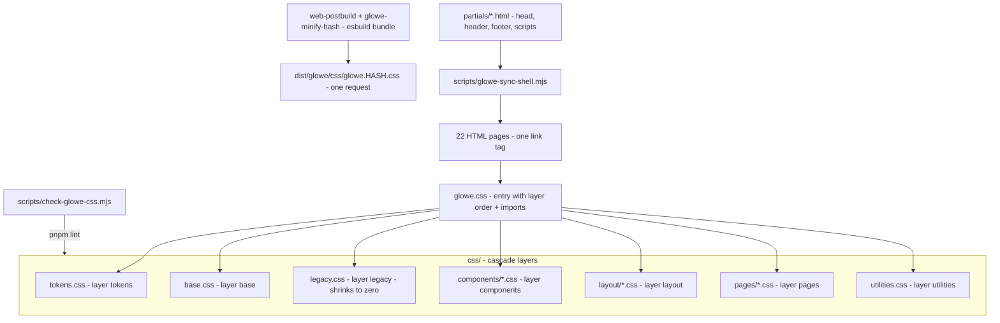

# GloWe Design System Reset — Implementation Plan

> **For agentic workers:** execute phase by phase, one PR per phase into `staging`. Each PR must be green on `pnpm typecheck && pnpm test && pnpm lint` (from `app/`) and on `CI — GloWe E2E (dev + staging)`. Steps use checkbox (`- [ ]`) syntax for tracking.

**Goal:** One professional, coherent visual language across every GloWe surface — every color, radius, shadow, spacing, font size and control inherits from a single global theme; every button, card, form control, modal, toast and empty state is one component family; every page is fluid across phone, tablet and desktop with a single breakpoint set; RTL is first-class. The bar is "Facebook-grade polish, GloWe palette". Code quality (small files, no duplication, lint-enforced rules) and runtime efficiency (one CSS request, no render-blocking font chain, no layout shift on shell paint) are part of the deliverable.

**Spec:** `docs/SSOT/spec/17_glowe_frontend.md` → `FR-GLOWE-029`. **Decision:** `docs/SSOT/DECISIONS.md` → `D-190`.

**Target:** `https://staging.karma-community.pages.dev/glowe/` (branch `staging`, per `D-189`). Release to `dev` only after the PM signs off on staging.

---

## 0. Baseline audit (2026-09-09, `staging` @ v1.4.7)

| Dimension | Finding |
| --- | --- |
| Stylesheet | `css/styles.css` — **9,325 lines, one file**, ~192 KB unminified |
| Tokens | 25 custom properties in `:root`; **no** spacing / type / z-index / motion / font tokens; **13 undefined** `var(--…)` names referenced in production CSS |
| Hardcoded values | 146 hex + 181 `rgba()` colors outside `:root`; 223 `font-size` declarations (63 distinct); ~327 `padding` and ~255 `gap` declarations with no token; 12 distinct `z-index` levels |
| Buttons | `.btn` + 6 modifiers, plus **~12 parallel button families** (`.header-icon-btn`, `.filter-pill`, `.post-actions button`, `.glowe-filter-tabs button`, `.community-feed-tabs button`, `.bottom-nav-create`, `.create-menu-option`, `.follow-btn`, …) that redefine padding/radius/font from scratch |
| Cards | ~25 card classes; padding ranges 14–32px; two surface systems (tinted `--card-surface` vs white panel) |
| Forms | 1 base (`.form-group …`) + ≥5 divergent control styles (filters, search, admin, chat, lang toggle) |
| Empty states | 3 patterns (`.empty-state`, `.compact-empty`, `.empty-detail`) |
| Responsive | **33 media blocks, 15 distinct breakpoints** (420/480/560/600/640/680/700/760/761/768/880/899/900/992/1180); `.main-nav` styled at 480/420 while hidden at 680 (dead rules); 900px block appears twice |
| RTL | ~104 physical `left/right` declarations vs ~41 logical; RTL block re-assigns physical sides instead of using logical properties |
| `!important` | 36 |
| Duplicate selectors | 176 selectors defined 2+ times (`.main-nav` ×5, `.community-right-rail` ×4, …) |
| Fonts | `body` asks for `'Inter'` which is **never loaded** (machines with Inter installed render differently); Assistant/Heebo/Arabic/Ethiopic loaded via render-blocking `@import` at the top of the CSS |
| Shell | Static `<header>`/`<footer>` **drift** across 22 pages (Forums link, dual auth buttons, legacy user-menu, empty nav shells) and are then rebuilt by `app.js` (`normalizeMainNavigation`, `ensureGlobalFooter`, …) → visible flash + duplicated markup |
| JS rendering | `app.js` 10,413 lines of template strings; 21 occurrences of the literal `btn btn-primary btn-small`; dozens of inline `.empty-state` blobs; native `window.confirm` for destructive actions |
| CI | `glowe-visual` on PRs snapshots the **deployed** staging URL, not the PR's code → visual changes cannot be validated before merge |

## 1. Target architecture

### Cascade layer order

`@layer tokens, base, legacy, components, layout, pages, utilities;`

`legacy` sits **below** the new component/layout layers, so a migrated component wins over the old rule regardless of selector specificity. Migration = move a block out of `legacy.css` into its layer, delete the old rule. `legacy.css` shrinks to zero across phases; the CSS guard ratchets its line count and forbids it from growing.

### Token model (`css/tokens.css`)

- **Palette (fixed, from the current brand):** primary teal `#147c75`, primary dark `#073f42`, accent gold `#b99057`, page `#f6f7f4`, ink `#111918`. Scales are derived from these: `--color-primary-50…900`, `--color-secondary-*`, `--color-accent-*`, `--color-neutral-0…900`, semantic `--color-success|warning|danger|info-{fg,bg,border}`.
- **Semantic aliases** used by components: `--surface-page`, `--surface-card`, `--surface-card-tinted`, `--surface-raised`, `--surface-overlay`, `--text-strong|body|muted|inverse|link`, `--border-subtle|default|strong`, `--focus-ring`.
- **Spacing:** 4px grid `--space-1…16`.
- **Type:** `--font-sans` (Nunito), `--font-hebrew`, `--font-arabic`, `--font-ethiopic`; size scale `--text-xs…4xl`; `--leading-tight|snug|normal|relaxed`; `--weight-regular|semibold|bold|extrabold`.
- **Shape / elevation:** `--radius-xs|sm|md|lg|full`; `--shadow-xs|sm|md|lg`.
- **Controls:** `--control-h-sm 36px`, `--control-h-md 44px` (touch target), `--control-h-lg 52px`.
- **Z-index scale:** `--z-header 100`, `--z-dropdown 200`, `--z-bottom-nav 900`, `--z-modal 1000`, `--z-consent 1100`, `--z-toast 1200`.
- **Motion:** `--duration-fast|base|slow`, `--ease-standard`; all animation disabled under `prefers-reduced-motion`.
- **Legacy aliases** (`--primary-color`, `--text-secondary`, `--radius-md`, …) are kept and re-pointed to the new tokens so `legacy.css` keeps working unchanged during migration.

### Breakpoints (single set; the guard rejects any other)

| Name | Min-width | Max-width form | Use |
| --- | --- | --- | --- |
| `xs` | — | `(max-width: 479px)` | small phones |
| `sm` | `480px` | `(max-width: 639px)` | phones |
| `md` | `640px` | `(max-width: 767px)` | large phones / small tablets |
| `lg` | `768px` | `(max-width: 1023px)` | tablets — top nav appears, bottom nav hides |
| `xl` | `1024px` | `(max-width: 1279px)` | desktop |
| `2xl` | `1280px` | — | wide desktop (container 1200px) |

Mobile-first: base rules target phones; `min-width` queries add complexity upward. Layout uses fluid grid/`clamp()`; no fixed pixel widths for content columns.

### Component families (each one file ≤ 300 lines under `css/components/`)

`buttons` (`.btn` + `-primary|-secondary|-outline|-ghost|-danger`, sizes `-small|-large`, `-block`, `-icon`, `.is-saved`, `:disabled`, `[aria-busy]`, `:focus-visible`), `chips` (filter pills + tab pills), `forms` (`.form-control`, `.form-group`, `.form-label`, `.form-hint`, `.is-invalid`, select/textarea/search), `cards` (`.card`, `.card--tinted`, `.card__header|body|footer|actions`), `modal`, `feedback` (toast, alert, empty-state, skeleton, badge), `avatar`, `menu` (more-menu / dropdown), `nav-tabs`.

### Shell (`css/layout/shell.css` + `partials/`)

The header, footer, bottom nav and base script list become **partials** stamped into every page between HTML comment markers by `app/scripts/glowe-sync-shell.mjs`. `--check` mode runs in `pnpm lint` and fails on drift. The static markup matches exactly what `app.js` renders, so the JS pass becomes idempotent (no flash). Header: 56px sticky bar, logo, pill nav, one auth CTA, icon actions. Mobile (`< 768px`): top nav hidden, 5-slot bottom tab bar with centered create FAB, safe-area padding.

### JS layer (professional call, per PM delegation)

- New `js/ui/` UMD modules with vitest coverage: `glowe-ui-primitives.js` (`buttonHtml`, `iconButtonHtml`, `emptyStateHtml`, `skeletonHtml`, `badgeHtml`), `glowe-ui-dialog.js` (one modal shell builder + `confirmDialog()` replacing `window.confirm`), `glowe-ui-shell.js` (header/footer/bottom-nav builders **moved** out of `app.js`).
- `app.js` call sites switch to the primitives (no more inline `btn btn-primary btn-small` literals, no more ad-hoc empty-state blobs). `app.js` shrinks as code moves out; a full domain split of `app.js` is **out of scope** here and tracked as `TD-191`.
- No bundler, no framework: keeps the zero-build static-site model (`D-61`, `D-188`).

## 2. Phases (one PR each → `staging`)

### Phase 1 — Foundation (this PR)

- [x] `css/glowe.css` entry with cascade-layer order; `css/tokens.css`; `css/base.css` (reset, typography, focus ring, reduced motion, container); `css/components/buttons.css`; `css/components/forms.css`; `css/components/feedback.css`; `css/legacy.css` (= old `styles.css` minus migrated blocks; `:root` re-pointed to tokens; font `@import` removed).
- [x] Fonts: one Google Fonts `<link>` (Nunito + Assistant + Heebo + Noto Sans Arabic + Noto Sans Ethiopic, `display=swap`) in the shared head partial; body font stack drops the never-loaded `Inter`.
- [x] `partials/` + `app/scripts/glowe-sync-shell.mjs` (stamp + `--check`); all 22 pages stamped; drifted static headers/footers replaced with the canonical shell.
- [x] `app/scripts/check-glowe-css.mjs` guard (no raw colors / `!important` / off-set breakpoints outside `tokens.css`; `legacy.css` ratchet) + node tests; wired into `pnpm lint`.
- [x] `glowe-minify-hash.mjs`: CSS entry bundled with `esbuild.build({ bundle: true })` so production ships **one** hashed CSS file.
- [x] `ci-e2e-glowe.yml`: `glowe-visual` on `pull_request` serves the PR checkout on `127.0.0.1:4321` and snapshots **that**, so design PRs are validated before merge; push events keep snapshotting the deployed URL.
- [x] SSOT: `FR-GLOWE-029`, `D-190`, `TD-191`/`TD-192`, `BACKLOG` row `GLOWE.DS`, `app/VERSION` bump.

### Phase 2 — Shell & layout

- [x] Shell CSS in the `layout` layer — split into `css/layout-header.css`, `layout-header-actions.css`, `layout-footer.css`, `layout-bottom-nav.css`, `layout-page-header.css` (flat under `css/` because the logo consumes a `url()` token; nested sheets resolve `url()` against their own folder — `check-glowe-css` now guards this). Removed the duplicated `.main-nav` / header / footer / bottom-nav / page-header blocks from `legacy.css`; tablets (768–1023px) get a two-row header so nav labels never truncate.
- [x] `js/ui/glowe-ui-shell.js` (UMD + vitest): nav / bottom-nav / footer / user-menu / auth-button builders and page resolution moved out of `app.js`, which now delegates.
- [x] Bottom nav `< 768px`, top nav `≥ 768px` (was 680px). Auth visibility is `body.glowe-signed-in` (no inline `style.display`, no `!important`). List-filter sheet moved into `css/components/list-filters.css` and its `SHEET_MQ` aligned to `< 768px` (was 900px) — this also fixed the sheet button leaking onto desktop once `.btn` moved into the `components` layer.
- [x] Visual baselines: shell header for `home`, `wishing-well`, `community`, `organizations`, `my-applications`, `messages`, `settings` × 390 / 768 / 1280, footer × 3, bottom nav @ 390, Hebrew RTL header.
- [x] TD-193: `GLOWE_BACKEND=dev` pin (`backend-config.js` override via `window.GLOWE_BACKEND_OVERRIDE` / `localStorage['glowe-backend']`, seeded into Playwright storage state) so the journeys job serves the PR checkout on `pull_request`, like the visual job. `tests/e2e/glowe-serve.json` (`cleanUrls: false`) keeps query strings (`messages.html?chat=…`) intact under `serve`.
- [x] Text gaps: the filter-sheet strings (`Filter wishes/organizations/opportunities`, `Show results`, the three "open" labels) were missing from all four locale bundles.

### Phase 3 — Controls & cards ✅ (2026-09-09)

- [x] `css/components/chips.css`, `cards.css`, `avatar.css`, `menu.css`, `nav-tabs.css`, `modal.css`. Each file owns the canonical family and aliases the legacy class names until Phase 4 removes them per page; `menu.css` uses logical insets so the `html[dir=rtl]` mirrors were deleted.
- [x] Remap the ~12 ad-hoc button families to `.btn` variants (`.header-icon-btn` → `.btn.btn-icon.btn-small`, `.filter-pill`/tabs → `.chip`, `.bottom-nav-create` → `.btn.btn-fab`, save/share/edit-name/section-collapse/comment-thread toggles → `.btn-icon`/`.btn-outline.btn-pill`/`.btn-link`). Old rules (incl. the `!important` pile on directory-card menus) deleted from `legacy.css`; `btn-sm` typo fixed. Dead `.heart-button`/`.card-open-button`/`.wish-image`/`savedToggleIconHtml` removed.
- [x] One card shell for post / wish / opportunity / org / forum / saved / profile-section / admin / option cards (`components/cards.css`, `:has(input:checked)` for option cards). `renderPostCard` still builds its inner rows inline — `TD-138` stays open for Phase 4.
- [x] `js/ui/glowe-ui-primitives.js` (`buttonHtml`, `iconButtonHtml`, `emptyStateHtml`, `loadingStateHtml`, `badgeHtml`, `menuItemHtml`) + `glowe-ui-dialog.js`; every `window.confirm`, 36 inline empty-state blobs, 4 loading placeholders and all `...` menu rows replaced in `app.js`.
- [x] Modals: one shell (`.modal`, `.modal-content`), `<button>` close controls, focus trap + `Escape`, backdrop dismiss, scroll lock via `body.glowe-modal-open`, `aria-modal`, promise-based `confirm()`.
- `legacy.css` budget ratcheted 8 092 → 6 893.

### Phase 4 — Pages

- [ ] Per page, move page-specific rules from `legacy.css` into `css/pages/<page>.css` (≤ 300 lines each; the entry imports them all — they are tiny once components carry the weight). Order by traffic: home → wishing-well → community → organizations/volunteer-network → my-applications/profile → messages/connections → settings → forums/discussion → about/whats-next → admin → legal.
- [ ] Remove duplicated media blocks; convert physical `left/right` to logical properties; delete every rule referencing an undefined variable.
- [ ] Text gaps fixed opportunistically (untranslated keys, inconsistent capitalisation, truncated labels) — logged, not the focus.

### Phase 5 — Cleanup & hardening

- [ ] `legacy.css` reaches 0 lines and is deleted; guard ratchet becomes a hard ban.
- [ ] Zero `!important` outside `utilities.css`; zero raw colors outside `tokens.css`; zero non-canonical breakpoints.
- [ ] Lighthouse (mobile) on staging: Performance ≥ 90, Accessibility ≥ 95, no CLS from shell paint; axe scan clean on all pages.
- [ ] `app/VERSION` MINOR bump (`1.4.x` → `1.5.0`) with the release PR `staging` → `dev`.

## 3. Definition of done (per phase and overall)

1. `pnpm typecheck && pnpm test && pnpm lint` green from `app/`; `node --test scripts/*.test.mjs` green.
2. `CI — GloWe E2E (dev + staging)` green, visual baselines updated **in the same PR**.
3. Browser-verified on the served checkout at 390×844, 768×1024, 1280×900, in `en` (LTR) and `he` (RTL); zero console errors.
4. SSOT updated in the same PR (`spec/17_glowe_frontend.md` FR-GLOWE-029 AC status, `BACKLOG.md`, `TECH_DEBT.md`), `app/VERSION` PATCH bumped.

## 4. Known anomalies to review later (not the focus)

- ~~`.user-menu` visibility is driven by inline `style.display` from `auth.js` and `app.js` plus `html.glowe-expect-member` early-paint rules with `!important`; should become a single `body.glowe-signed-in` state class.~~ Done in Phase 2.
- `pages/opportunities.html`, `saved.html`, `write-post.html` are redirect stubs that still ship a full shell; consider server-side `_redirects` entries.
- `about.html` carries inline layout styles (`max-width`, `margin-top`, `text-align`) — Phase 4.
- Legacy multi-step registration wizard (`renderRegistrationWizardLegacy`, ~110 dead strings) — `TD-143`.
- Org profile `<h1>` falls back to the internal slug when no display name is set (noted in `TD-142`).
